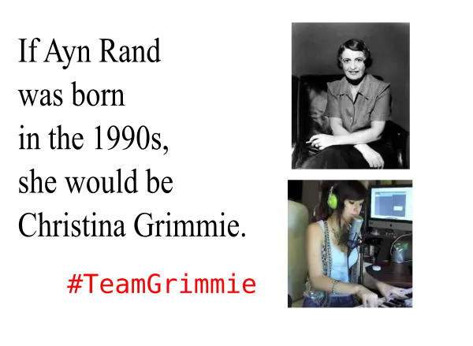

# Captioned Image: Ayn Rand to Christina Grimmie

## Preview

## About

A captioned image reading "If Ayn Rand was born in the 1990s, she would be Christina Grimmie.".

Photo credits:

1. Ayn Rand photo taken from https://en.wikipedia.org/wiki/Ayn_Rand and
https://en.wikipedia.org/wiki/File:Ayn_Rand1.jpg .

2. Christina Grimmie still taken from her cover video for Bruno Mars’
“Locked out of Heaven” - https://www.youtube.com/watch?v=pQJXyOvKNK0

Midrash/study/explanation of the image can be found here:

* http://www.shlomifish.org/humour.html#if_ayn_rand_was_born_in_the_1990s .

Perhaps it would have worked better with Socrates instead of Ayn Rand.
